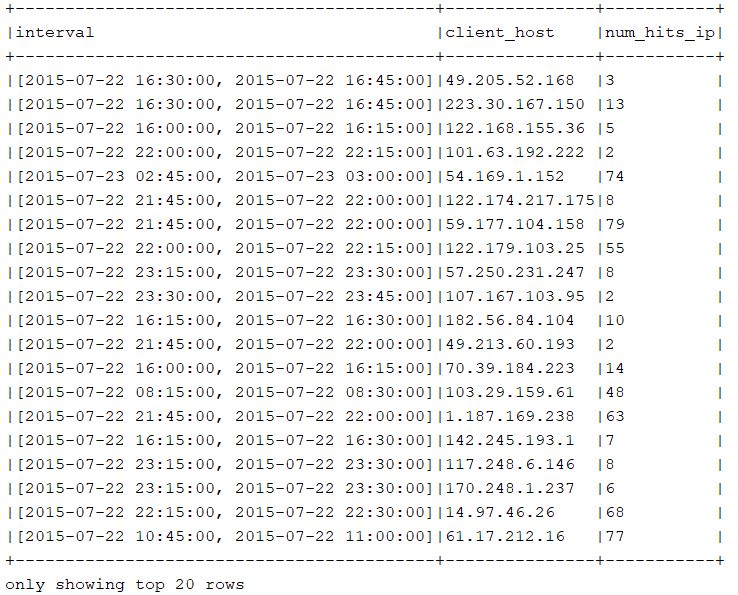

# DataEngineerChallenge 
## Code And Results

* Preparing Spark Datasets
```
//Input Schema
case class LogSchema(create_time:Timestamp, elb:String, client_host_port:String, backend_host_port:String, request_processing_time:Double, backend_processing_time:Double, response_processing_time:Double, elb_status_code:Int, backend_status_code:Int, received_bytes:Int, sent_bytes:Int, request:String, user_agent:String, ssl_cipher:String, ssl_protocol:String)

val encoder = Encoders.product[LogSchema]
val schema=encoder.schema
//load log data into spark-dataset
//loading input gz file
//we will be doing repartition to make more parallel
val inputDataset:Dataset[LogSchema]=spark
  .read
  .option("delimiter"," ")
  .option("quote","\"")
  .option("header",false)
  .option("charset",StandardCharsets.UTF_8.name())
  .schema(schema)
  .csv(inputPath)
  .as(encoder)
  .repartition(numOfPartitions)
```
1. Sensitize the web log by IP. Sensitize = aggregate all page hits by visitor/IP during a session.
    ```
    val formattedDatasets=inputDataset
      .withColumn("client_host",split(inputDataset("client_host_port"),":").getItem(0))
        .withColumn("url",split(inputDataset("request")," ").getItem(1))
    //formattedDatasets.show(false)
    //removing extra not used columns
    var datasetForSessionize=formattedDatasets.select("create_time","client_host","url")
    datasetForSessionize=datasetForSessionize.persist(StorageLevels.MEMORY_AND_DISK_SER_2)
    
    //GET total hits from a host during an interval
    var sessionedData=datasetForSessionize.withColumn("interval", window(datasetForSessionize("create_time"), "15 minutes"))
    //persisting datasets as we will be using this multiple times.
    ///sessionedData=sessionedData.persist(StorageLevels.MEMORY_AND_DISK_SER_2)
    //sessionedData.show(false)
    val dsForTotalHits=sessionedData.groupBy(sessionedData("interval"),sessionedData("client_host")).count().as("num_hits_ip")
    dsForTotalHits.show(false)
    ```
    
2. Determine the average session time
    ```
    //get first hit for a ip per session
    //get last hit for a ip per session
    //difference between last hit and first hit will be taken a active session
    //not considering any idle time
    var df3=sessionedData.groupBy("interval","client_host")
      .agg(
        min("create_time").as("first_hit_time"),
        max("create_time").as("last_hit_time")
      )
    //get duration in seconds
    //removing extra columns
    df3=df3.withColumn("session_duration",unix_timestamp(df3("last_hit_time"))-unix_timestamp(df3("first_hit_time")))
      .drop("first_hit_time")
      .drop("last_hit_time")
    sessionedData=sessionedData.join(df3,Seq("interval","client_host"))
    //sessionedData=sessionedData.persist(StorageLevels.MEMORY_AND_DISK_SER_2)
    
    //find mean avg among all session durations.
    val avgSession = sessionedData.groupBy().avg("session_duration")
    avgSession.show(false)
    ```
    

3. Determine unique URL visits per session. To clarify, count a hit to a unique URL only once per session.
    ```
    val uniqueUrlHits = sessionedData.groupBy("client_host","interval","URL").count().distinct().withColumnRenamed("count", "unique_url_hits")
    //uniqueUrlHits.write.mode(SaveMode.Overwrite).parquet("data/output/unique_url_visits_per_session")
    uniqueUrlHits.show(false)
    ```
    

4. Find the most engaged users, ie the IPs with the longest session times
    ```
    val longestSession= sessionedData.sort(desc("session_duration")).distinct()
    longestSession.show(false)
    ``` 
    